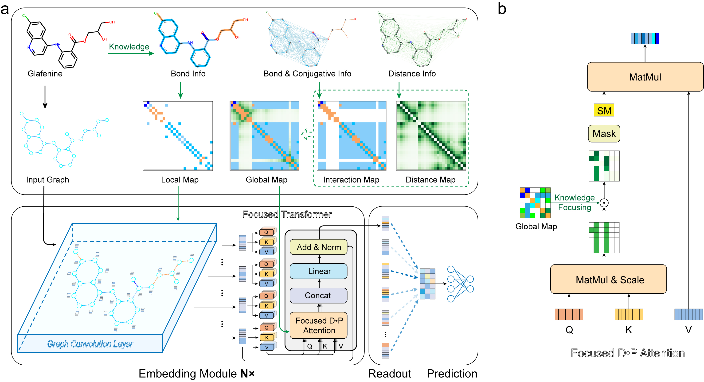

# TransFoxMol




This is a Pytorch implementation of the following paper: 
TransFoxMol: Perceiving Chemical Structure with Focused Attention


## Installation
You can just execute following command to create the conda environment.
'''
conda create --name TFM --file requirements.txt
'''

## Usage

#### 1. Dataset preparation
Put your raw csvfile(`DATASET_NAME.csv`) in `dataset/raw/`.
```
python molnetdata.py --moldata DATASET_NAME --task clas --ncpu 10
```
This will save the processed dataset in `dataset/processed/`.

#### 2. Hyper-parameter searching
```
python run.py search DATASET_NAME --task clas --device cuda:0
```
This will return the best hyper-params.

#### 3. Training
```
python run.py train DATASET_NAME \
               --task reg \
               --device cuda:0 \
               --batch_size 32 \
               --train_epoch 50 \
               --lr 0.0005 \
               --valrate 0.1 
               --testrate 0.1 \
               --seed 426 \
               --fold 3 \
               --dropout 0.05 \
               --attn_head 6 \
               --attn_layers 2 \
               --output_dim 256 \
               --D 4 \
               --metric rmse
```
This will save the resulting model in `log/checkpoint/`.

#### 4. Testing
```
python run.py test DATASET_NAME \
               --task clas \
               --device cuda:0 \
               --batch_size 32 \
               --attn_head 6 \
               --attn_layers 2 \
               --output_dim 256 \
               --D 4 \
               --pretrain log/checkpoint/XXXX.pkl
```
This will load the model in `log/checkpoint/` to make predictions and the results are saved in `log/`.
